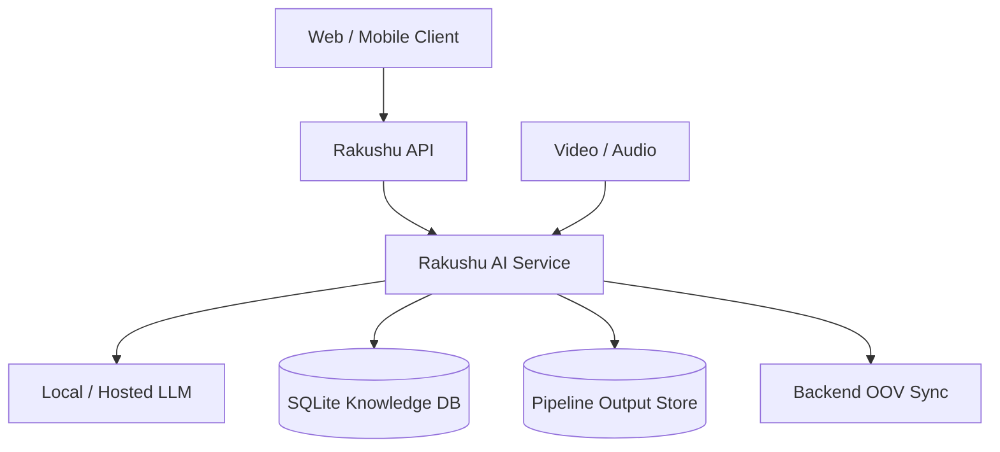
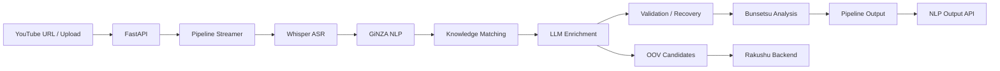
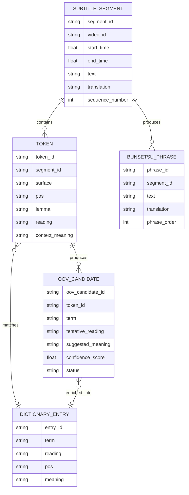

# Rakushu AI Service
## Japanese Language Intelligence & Learning Pipeline

**Short Name:** Rakushu AI Service  
**Full Name:** Rakushu Japanese Language Intelligence & Learning AI Service

Rakushu AI Service is the AI-processing backend of the Rakushu Japanese-learning platform. It transforms Japanese video and audio into structured learning data through ASR, Japanese NLP, knowledge matching, contextual LLM processing, OOV learning, and Bunsetsu analysis.

Rakushu AI Service は、Rakushu 日本語学習プラットフォームの AI 処理バックエンドです。音声認識、日本語 NLP、Knowledge Matching、LLM 処理、OOV 学習、文節（Bunsetsu）解析を通して、動画・音声を構造化された学習データへ変換します。

---

# 1. Project Overview / プロジェクト概要

## 1.1 Project Name / プロジェクト名

**Short Name:** Rakushu AI Service  
**Full Name:** Rakushu Japanese Language Intelligence & Learning AI Service

## 1.2 Description / 概要

The service owns the language-intelligence part of Rakushu. Its main pipeline is:

```text
Video / Audio
     ↓
ASR
     ↓
Japanese NLP
     ↓
Knowledge Matching
     ↓
LLM Translation & Candidate Selection
     ↓
OOV Learning
     ↓
Bunsetsu Analysis
     ↓
Structured Learning Output
```

Rakushu AI Service は、Rakushu における Language Intelligence を担当し、入力メディアから学習者向けの言語情報を生成します。

## 1.3 Core Solutions / コアソリューション

### 01. Intelligent Japanese Video Processing

Processes YouTube URLs or uploaded media and produces subtitles, tokens, linguistic metadata, translations, knowledge matches, OOV candidates, and Bunsetsu structures.

### インテリジェント日本語動画処理

YouTube URL またはアップロードされたメディアから、字幕、Token、言語メタデータ、翻訳、Knowledge Match、OOV Candidate、Bunsetsu 構造を生成します。

### 02. Knowledge-Grounded Japanese Translation

The LLM receives server-owned linguistic candidates and contextual information instead of inventing dictionary meanings. Candidate selections are validated by the service before being propagated to downstream results.

```text
Token
  ↓
Grammar / Phrase / Compound Word / Word
  ↓
Candidate Set
  ↓
LLM Selection
  ↓
Server-side Validation
  ↓
Validated Meaning
```

### Knowledge に基づく日本語翻訳

LLM には Server が管理する候補情報と Context を提供します。LLM の選択結果は Server 側で検証し、Dictionary / Knowledge の情報を勝手に変更しない設計です。

### 03. Reliable Chunked LLM Enrichment

Longer content is processed using bounded translation chunks. Incomplete batches can retry only missing sentences and can adaptively split failed batches before merging successful results.

```text
Chunk Planner
     ↓
LLM Batch
     ↓
Validation
     ↓
Missing Sentences?
   ┌───┴───┐
  No      Yes
   ↓        ↓
Continue  Retry Missing
              ↓
         Adaptive Split
              ↓
           Continue
```

### 信頼性を重視した Chunked LLM 処理

長いコンテンツを一定サイズの Chunk に分割し、不足した文だけを Retry します。それでも失敗する場合は Chunk を分割して再処理します。

## 1.4 Applied Methods / 適用技術・手法

| Method | Role |
|---|---|
| **ASR / Whisper** | Japanese speech-to-text |
| **NLP / GiNZA** | Japanese morphology, POS, dependency and sentence analysis |
| **Janome** | NLP fallback tokenizer |
| **Knowledge Matching** | Grammar, phrase, compound-word and dictionary matching |
| **LLM** | Translation, contextual interpretation, candidate selection and OOV learning |
| **SRS-ready data** | Structured vocabulary information for downstream spaced-repetition learning |
| **OOV Processing** | Unknown-vocabulary detection and enrichment |
| **Bunsetsu Analysis** | Japanese phrase grouping and dependency-aware learning units |
| **Validation & Recovery** | Structured output validation and partial-result recovery |
| **SSE** | Progressive pipeline result streaming |

---

# 2. Implementation / 実装

## 2.1 Domain Modeling

Rakushu AI Service is not a full traditional DDD application, but it uses domain-oriented models for language-processing concepts.

Core models include:

- `SubtitleSegment`
- `SentenceSubtitle`
- `TokenModel`
- `DictionaryEntry`
- `OovCandidate`
- `BunsetsuPhrase`
- `PipelineResult`
- `GrammarEntry`
- `PhraseEntry`
- `CompoundWordEntry`
- `MatchedKnowledgeUnit`

These models allow ASR, NLP, Knowledge, LLM and Bunsetsu stages to communicate through explicit domain data instead of raw infrastructure objects.

### Domain Modeling / ドメインモデリング

完全な DDD Application ではありませんが、Language Domain を明確にするため Domain-oriented な Model を使用しています。Subtitle、Token、Dictionary、OOV、Knowledge、Bunsetsu などを独立した概念として表現します。

## 2.2 Software Architecture

The current source architecture separates HTTP transport, pipeline orchestration, processing services, and data models.

```text
src/
├── api/       # FastAPI transport and routers
├── pipeline/  # Pipeline orchestration and streaming
├── services/  # ASR, NLP, LLM, Knowledge, OOV, Bunsetsu, integrations
├── models/    # Shared language and pipeline models
└── utils/     # Shared helpers
```

### Layer Responsibilities

**API Layer** — FastAPI routers, request/response contracts, SSE responses, dictionary and NLP output APIs.

**Pipeline Layer** — End-to-end orchestration and progressive pipeline events.

**Service Layer** — ASR, NLP, LLM, Knowledge, OOV, Bunsetsu, media and external integration logic.

**Model Layer** — Shared domain/data contracts.

**Utility Layer** — Shared infrastructure helpers.

Basic dependency direction:

```text
API → Pipeline → Services → Models
```

Models do not depend on API or pipeline orchestration.

### ソフトウェアアーキテクチャ

API、Pipeline、Services、Models、Utils の責務を分離しています。API は HTTP/SSE、Pipeline は処理順序、Services は AI / NLP / Knowledge 処理、Models は共通データ構造を担当します。

## 2.3 Design Patterns / 設計パターン

### Service Layer Pattern

Major responsibilities are isolated behind dedicated services such as `AsrService`, `NlpService`, `KnowledgeService`, `LlmEnrichmentService`, `BunsetsuService`, and `OovService`.

### Strategy / Fallback Pattern

NLP supports GiNZA first, then Janome, then a basic tokenizer fallback. ASR prefers local faster-whisper and can use an OpenAI Whisper path when configured.

### Pipeline / Orchestration Pattern

Multiple processing stages are composed into a single controlled workflow:

```text
Media → ASR → Segmentation → NLP → Knowledge → LLM → Bunsetsu → Output
```

### Validation & Recovery Pattern

LLM output is treated as untrusted structured data. The service validates sentence IDs, expected results, token keys, candidate IDs, candidate ownership, and translation presence.

### Adaptive Retry / Partial Recovery

```text
Batch → Retry Missing Subset → Split Batch → Retry Smaller Batches → Merge
```

This prevents one incomplete LLM response from invalidating the complete translation job.

### 設計パターン

Service Layer、Strategy/Fallback、Pipeline Orchestration、Validation/Recovery、Adaptive Retry などを利用し、AI 処理の責務分離と障害耐性を高めています。

---

# 3. Technical / 技術

## 3.1 API — FastAPI

Rakushu AI Service exposes a lightweight API using **FastAPI**.

Main responsibilities:

- End-to-end video processing
- YouTube / media URL ingestion
- Multipart upload
- Progressive SSE streaming
- Completed NLP token retrieval
- Bunsetsu output retrieval
- Dictionary lookup
- Internal dictionary / OOV synchronization

Main API surface:

```text
/api/v1/pipeline
    ├── /stream-url
    └── /stream-upload

/api/v1/nlp
    ├── /videos/{video_id}/tokens
    └── /videos/{video_id}/bunsetsu

/api/v1/dictionary
    └── /lookup

/api/v1/internal
    ├── /dictionary/sync
    └── /oov/sync-status
```

### SSE Streaming

```text
Client → FastAPI → Pipeline Streamer → SSE
                              ├── sentence_processed
                              ├── chunk_completed
                              └── pipeline_completed
```

### FastAPI / FastAPI

FastAPI を HTTP / SSE Transport として使用し、Router によって Pipeline、NLP、Dictionary の API を分離しています。

## 3.2 AI & Language Processing Stack

### ASR — Whisper

Converts Japanese speech into text. FFmpeg is used for audio extraction, while media inspection and transcription safety checks are applied before and during processing.

### NLP — GiNZA / spaCy

Provides sentence segmentation, tokenization, POS, lemma, reading, dependency metadata, and Bunsetsu-related metadata. Janome is available as a fallback tokenizer.

### LLM — Ollama / Qwen

The current integration uses a local LLM endpoint by default. LLM processing covers Vietnamese translation, contextual interpretation, candidate selection, and structured OOV learning.

### Knowledge — SQLite

The Knowledge Service uses a local SQLite dictionary for offline lookup and enrichment across grammar, phrase, compound-word, and dictionary knowledge.

### Other Processing

- **FFmpeg** — audio extraction
- **SSE** — progressive client updates
- **Pipeline Output Store** — completed NLP/pipeline result access

### AI / Language Processing Stack / AI・言語処理スタック

Whisper、GiNZA、Janome、Ollama/Qwen、SQLite、FFmpeg を組み合わせ、日本語学習向けの AI Processing Pipeline を構成しています。

---

# 4. Hosting & Infrastructure / ホスティング・インフラ

Rakushu AI Service is designed as an independently deployable AI-processing service alongside the main Rakushu backend.



The AI Service owns computational language-processing workloads while the main backend owns the broader application/business workflow.

### インフラ構成

AI Service は Main Backend と分離可能な AI Processing Service として設計されています。LLM Runtime、Knowledge Store、Pipeline Output、Backend Sync と連携し、言語処理を担当します。

> AWS-specific services are intentionally not listed unless they are part of the current AI Service implementation.

---

# 5. End-to-End Architecture / 全体アーキテクチャ



## Pipeline Data Flow / パイプラインデータフロー

```text
[Video / Audio]
      ↓
[ASR Service]
      ↓
[Sentence Segmentation]
      ↓
[NLP Service]
      ↓
[Knowledge Service]
      ↓
[LLM Service]
      ↓
[Validation / Recovery]
      ↓
[Bunsetsu Service]
      ↓
[Structured Learning Output]
```

---

# 6. Logical Data Model / 論理データモデル

The logical model centers on subtitle segments, tokens, dictionary knowledge, OOV candidates, and Bunsetsu phrases.



### Logical Relationships / 論理関係

- **SubtitleSegment → Token:** one segment contains multiple tokens.
- **SubtitleSegment → BunsetsuPhrase:** a segment can produce multiple Bunsetsu phrases.
- **Token → DictionaryEntry:** a token may match known dictionary knowledge.
- **Token → OOVCandidate:** unknown vocabulary can generate an OOV candidate.
- **OOVCandidate → DictionaryEntry:** reviewed/enriched vocabulary can become dictionary knowledge.

字幕セグメント、Token、Dictionary、OOV Candidate、Bunsetsu を中心に、ASR から学習可能な日本語データまでの関係を表現します。

---

# 7. Conclusion / 結論

Rakushu AI Service is a specialized Japanese language-processing backend focused on reliable AI-assisted learning data generation.

Its main engineering characteristics are:

- Japanese ASR
- Japanese NLP
- Knowledge-grounded LLM processing
- Candidate-level validation
- OOV learning
- Bunsetsu analysis
- Chunked translation
- Adaptive recovery
- Progressive SSE output
- Separation of API, pipeline, services, and models

Rakushu AI Service は、日本語学習に特化した Language Processing Backend です。AI の精度だけでなく、Validation、Recovery、構造化された学習データ、そして downstream learning experience を重視した設計になっています。

---

# 8. Contributors / 開発者

| Contributor | Responsibility |
|---|---|
| **Hòa** | Backend / System Development |
| **Huy** | AI Service / NLP / LLM / System Development |

---

<p align="center">
  <b>Rakushu AI Service</b><br>
  Japanese Language Intelligence & Learning Pipeline
</p>

<p align="center">
  <i>日本語学習を、AI とテクノロジーでもっとスマートに。</i>
</p>